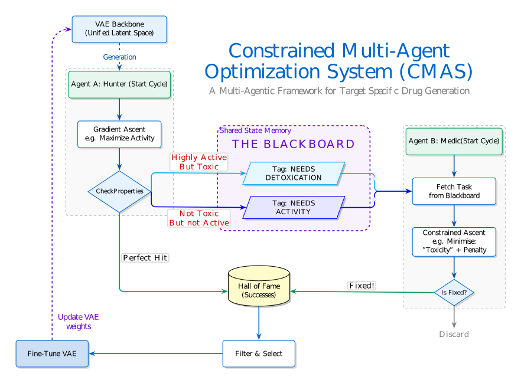

<p align="center">
  
</p>

# Multi-Agent Drug Design (MADM)

An AI-driven drug discovery pipeline that uses a collaborative multi-agent system together with a molecular generative model to design novel drug candidates with optimized pharmacological properties. The current configuration targets **AKT1 kinase** for oncology applications.

---

## Overview

MADM combines a Variational Autoencoder (VAE) for molecular generation with a team of specialized reinforcement-learning agents that perform gradient-based optimization directly in the VAE latent space. Agents work in parallel: Explorer agents (Hunters) search for potent molecules, while Specialist agents (Medics) fix property flaws in promising candidates. A shared Blackboard system coordinates task routing between agents, and the VAE's sampling distribution is periodically fine-tuned toward high-reward regions as discoveries accumulate.

Each molecule is evaluated across **12 properties**:
- **Potency** — predicted AKT1 binding activity
- **Hard filters** — hERG inhibition, CYP3A4 inhibition (safety-critical; failure discards the molecule)
- **Soft filters** — BBBP, Caco-2 permeability, HLM/RLM stability, P-gp substrate status, CYP1A2/2C9/2C19/2D6 inhibition (fixable; failure routes the molecule to a Medic)
- **Deterministic scores** — Synthetic Accessibility (SA) and Drug-likeness (QED)

---

## Repository Structure

```
Multi-Agent-Drug-Design/
├── Agents/
│   ├── BaseAgent.py          # Abstract base: gradient ascent, scoring, filter routing
│   ├── HunterAgent.py        # Explorer agents (potency + hard-filter optimization)
│   └── MedicAgent.py         # Specialist agents (constrained soft-filter repair)
├── Generators/
│   ├── MolGRUVAE.py          # GRU-based VAE architecture
│   ├── VAE.py                # VAE wrapper: training, generation, distribution update
│   └── metrics.py            # Validity, uniqueness, novelty, reconstruction metrics
├── Models/
│   ├── ActivityClassifier/   # AKT1 potency MLP + training scripts
│   └── AdmetClassifier/      # Multi-task ADMET classifier + training scripts
├── utils/
│   ├── Blackboard.py         # Shared task-queue and Hall of Fame
│   ├── ScoringEngine.py      # Unified scoring API
│   ├── ActivityClassifier.py # Potency predictor wrapper
│   ├── ADMETClassifier.py    # ADMET property predictor wrapper
│   ├── utils.py              # Config loading, VAE fine-tuning helpers
│   ├── generate.py           # Standalone molecule generation script
│   ├── sa_score.py           # Synthetic accessibility scoring
│   └── qed.py                # Drug-likeness (QED) scoring
├── Datasets/
│   ├── SMILESDataset.py      # Text-based SMILES dataset loader
│   └── BinarySMILESDataset.py# Memory-mapped NumPy dataset (10× faster training)
├── configs/
│   ├── PropertyConfig.yaml   # Property definitions, thresholds, hard/soft filters
│   └── paths.yaml            # Model and vocabulary paths
├── data/
│   └── preprocess.py         # Converts SMILES CSV → binary NumPy format
├── metrics/
│   ├── evaluate_pipeline.py  # End-to-end pipeline evaluation
│   ├── visualize_leads.py    # Lead compound visualization
│   └── scaffold.py           # Scaffold analysis utilities
├── src/
│   └── main.py               # Main discovery loop entry point
├── trained_vae/              # VAE checkpoint directory
├── vocab.json                # SMILES vocabulary (54 tokens)
├── requirements.txt
└── README.md
```

---

## Architecture

### Molecular Generation — VAE

**MolGRUVAE** encodes and decodes SMILES strings through a 128-dimensional continuous latent space.

- **Encoder:** Bidirectional GRU (hidden dim 256) → concatenated forward+backward states → FC layers → (μ, σ)
- **Decoder:** Unidirectional GRU initialized from latent vector; teacher-forced during training, sampled during inference
- **Training features:** Cyclic KL annealing, free-bits constraint (min 2.0 nats), word dropout (25%), mixed-precision (FP16), multi-GPU support via PyTorch DDP

### Property Scoring

| Model | Architecture | Output |
|-------|-------------|--------|
| ActivityClassifier | MLP (128 → 256 → 64 → 1) | AKT1 activity probability |
| ADMETClassifier | Shared encoder (128 → 1024 → 512) + 11 task heads | 11 ADMET property probabilities |

Both models take the VAE **latent vector** as input, enabling gradient flow through them during agent optimization.

### Multi-Agent System

| Agent | Count | Role | Optimization |
|-------|-------|------|-------------|
| HunterAgent (Potency) | 1 | Find potent AKT1 binders | Maximize activity score |
| HunterAgent (Hard filters) | 1 per hard filter | Avoid hERG/CYP3A4 toxicity | Minimize inhibition probability |
| MedicAgent | 1 per soft filter | Fix fixable property flaws | Constrained gradient descent |

**HunterAgents** perform unconstrained gradient ascent (30 steps, lr=0.05) from a scaffold-seeded or randomly sampled latent vector.

**MedicAgents** pick up flawed-but-promising molecules from the Blackboard and apply constrained gradient ascent (20 steps, lr=0.05) with an MSE penalty (λ=10) to repair the target property while staying near the original molecule.

### Blackboard (Shared Task Queue)

The Blackboard decouples agents via a publish/subscribe task queue. A molecule that fails a soft filter is posted to the appropriate queue; the responsible MedicAgent fetches it, repairs it, and routes the result back through the full filter pipeline. The Blackboard also maintains the **Hall of Fame** (all accepted molecules) and the current **scaffold anchor** used to seed new searches.

---

## Discovery Loop

```
100 GENERATIONS × 1000 STEPS
│
├─ Every step, each agent:
│  ├─ Samples z (scaffold-seeded or random)
│  ├─ Optimizes z via gradient ascent
│  ├─ Decodes z → SMILES (RDKit validated)
│  ├─ Scores 12 properties
│  └─ Routes: Pass → Hall of Fame + CSV
│             Soft fail → Blackboard queue
│             Hard fail → Discard
│
└─ Every 50 successes:
   └─ Fine-tune VAE sampling distribution toward high-reward region
```

Output is written incrementally to `test.csv`:

```
SMILES,scores
"O=C(CN1CCN...)","{'BBBP': 0.006, 'hERG_inhibition': 0.006, ...}"
```

---

## Installation

```bash
git clone <repo-url>
cd Multi-Agent-Drug-Design
pip install -r requirements.txt
```

**Requirements:** PyTorch, RDKit, NumPy, Pandas, PyYAML, scikit-learn, SciPy, Optuna, Transformers, openpyxl.

---

## Setup

### 1. VAE Checkpoint

Place a trained VAE checkpoint in `trained_vae/` and verify the path in `configs/paths.yaml`:

```yaml
vae_model_path: trained_vae/vae_weights_bidirec.pt
vocab_path: vocab.json
```

To **train the VAE from scratch**:

```bash
# 1. Add a ChemBL SMILES CSV to the data/ directory
# 2. Preprocess to binary format (much faster I/O during training):
python data/preprocess.py
# → data/ChemBL_Smiles.npy

# 3. Fine-tune:
python -c "
from Generators.VAE import VAE
vae = VAE()
vae.load_model('vocab.json')
vae.fine_tune('data/ChemBL_Smiles.npy', epochs=100)
"
```

### 2. Activity Classifier

Pre-trained checkpoint: `Models/ActivityClassifier/checkpoints/activity_classifier_mlp.pt`

To retrain:
```bash
python Models/ActivityClassifier/train_mlp.py
```

### 3. ADMET Classifier

Pre-trained checkpoint: `admet_predictor_bidirec_1000epochs.pt` (update path in `configs/paths.yaml`).

To retrain:
```bash
python Models/AdmetClassifier/train_multitask.py
```

---

## Running

```bash
python src/main.py
```

Key parameters in `src/main.py`:

```python
NUM_GENERATIONS      = 100
STEPS_PER_GENERATION = 1000
GOLDEN_SCAFFOLD      = "O=C(Cc1nc(N2CCOCC2)cc(=O)[nH]1)N1CCc2ccccc21"
```

### Standalone Generation

Generate and validate molecules from a trained VAE without running the full pipeline:

```bash
python utils/generate.py
```

---

## Configuration

### `configs/PropertyConfig.yaml`

Defines all property targets, thresholds, and filter categories:

```yaml
metadata:
  target: AKT1
  therapeutic_area: oncology
  profile: non_CNS

potency:
  target: high
  threshold: 0.5          # Minimum activity score to pass

hard_filters:             # Failure → molecule discarded
  hERG_inhibition:
    target: low
    threshold: 0.3
  CYP3A4_inhibition:
    target: low
    threshold: 0.4

soft_filters:             # Failure → routed to MedicAgent
  BBBP, Caco2_permeability, HLM_stability, RLM_stability,
  P-gp_substrate, CYP1A2/2C9/2C19/2D6_inhibition

deterministic:
  SA_score:  target: low,  threshold: 3.0
  QED:       target: high, threshold: 0.6
```

### `configs/paths.yaml`

```yaml
vae_model_path:      trained_vae/vae_weights_bidirec.pt
activity_model_path: Models/ActivityClassifier/checkpoints/activity_classifier_mlp.pt
admet_model_path:    admet_predictor_bidirec_1000epochs.pt
vocab_path:          vocab.json
output_path:         test.csv
```
